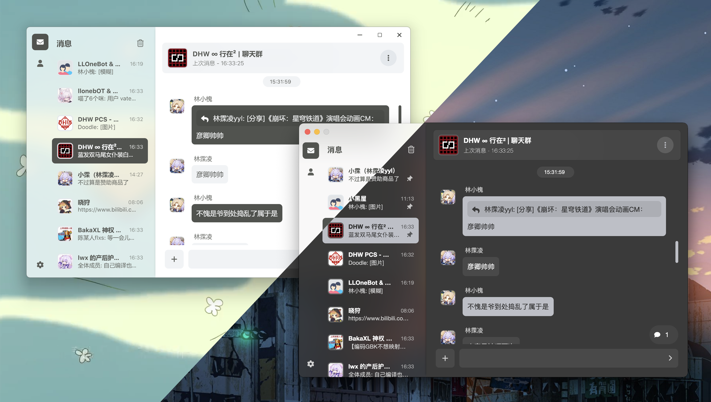

**[中文](README.md) | English**

> <strong>// Quick Ad //</strong><br />
> Want to connect to Napcat in the terminal? Check out [Stapxs QQ Shell](https://github.com/Stapxs/Stapxs-QQ-Shell)!<br />
---

<p align="center">
  <a href="https://blog.stapxs.cn" target="blank">
    
  </a>
  <h2 align="center" style="font-weight: 600">Stapxs QQ Lite</h2>
  <p align="center">
    An unofficial web QQ client compatible with OneBot
    <br />
    <a href="https://stapxs.github.io/Stapxs-QQ-Lite-2.0/" target="blank"><strong>🌎 Visit DEMO</strong></a>&nbsp;&nbsp;|&nbsp;&nbsp;
    <a href="https://github.com/Stapxs/Stapxs-QQ-Lite-2.0/releases" target="blank"><strong>📦️ Download</strong></a>&nbsp;&nbsp;|&nbsp;&nbsp;
    <a href="https://github.com/Stapxs/Stapxs-QQ-Lite-2.0/issues/new?assignees=Stapxs&labels=%3Abug%3A+%E9%94%99%E8%AF%AF&template=----.md&title=%5B%E9%94%99%E8%AF%AF%5D" target="blank"><strong>💬 Report Issues</strong></a>
    <br />
    <br />
    <strong>This web application is for learning and communication purposes only. Please do not use it for other purposes.</strong><br>
    <strong>For copyright disputes, please open an issue to negotiate.</strong>
  </p>
</p>



## ☕️ Sponsor the Project
<p align="center">
    <a href="https://www.ifdian.net/a/stapxs" target="_blank">
    
    </a>
</p>

## Community Versions
The following are some community-supported versions, highly recommended to try:
- [Stapxs QQ Lite X](https://github.com/Chzxxuanzheng/Stapxs-QQ-Lite-X): A community version with extended features, supporting more functionality closer to the official QQ client.
- [Stapxs QQ Lite Pre Preview](https://github.com/dev-soragoto/Stapxs-QQ-Lite-2.0-pre-release): A preview version of Stapxs QQ Lite that follows the dev branch updates, allowing you to experience the latest features.

## ✨ Feature Support

- ✅ Built with the Vue.js ecosystem, with a clean frontend-backend separation
- 🎨 Adaptive layout, usable in portrait mode
- 🖥️ PWA support (we already have Electron though (quietly))
- 🌚 Automatic Light/Dark Mode switching
- 🍱 Has all the essentials (though not as complete as the official client)
  - Complex message display, forwarding, replying, and recalling
  - Group files, group announcements, group settings (a small subset), and pinned messages
  - Image, sticker, and file sending
- 📦️ Supports multiple bots — I just want to use them!
- 🔥 An Electron client that's chaotic but better-looking
- 🥚 Easter eggs! More easter eggs!
- 🛠 More features under development

## ♿️ Quick Start

### > Run the Service

Stapxs QQ Lite requires a QQ Bot backend to provide services. Since deploying a QQ Bot can be complex, please visit the [Bot Compatibility](https://github.com/Stapxs/Stapxs-QQ-Lite-2.0/issues/76) issue to see the currently supported bots and choose one to read its deployment documentation.


### > Access the Web Page

This repository has GitHub Pages enabled, and all code committed to the main branch will be automatically built and published. You can directly visit [🌎 this page](https://stapxs.github.io/Stapxs-QQ-Lite-2.0) to use the pre-built and deployed online version.

### > Install the Client

In addition to using the build page from this repository directly, you can also download the **slightly** more feature-rich client version packaged with Electron. Visit [📦️ here](https://github.com/Stapxs/Stapxs-QQ-Lite-2.0/releases) to view the release list.

You can also use a package manager to install it, which makes it easier to update Stapxs QQ Lite without manually downloading from GitHub each time. Visit [💬 here](https://github.com/Stapxs/Stapxs-QQ-Lite-2.0/issues/99) to see the currently supported package managers.

### > Install in Napcat
Stapxs QQ Lite can also run as a Napcat plugin. Click the quick install button below to install it in the Napcat plugin store:

<a href="https://napneko.github.io/napcat-plugin-index?pluginId=napcat-plugin-ssqq" target="_blank">

</a>

### > Self-Host the Web Page

Stapxs QQ Lite builds Web files with each release. You can find them at [📦️ here](https://github.com/Stapxs/Stapxs-QQ-Lite-2.0/releases), usually named `Stapxs.QQ.Lite-<version>-web.zip`. Download and extract it, then place it on your web server.

Not sure how to set up a web server? Stapxs QQ Lite web version has been published to [npm](https://www.npmjs.com/package/ssqq-web)! You can use the npx tool to start it quickly:

``` bash
npx ssqq-web hostname=127.0.0.1 port=8081
```

### > Deploy with Docker

Stapxs QQ Lite natively supports Docker deployment. Use the command
``` bash
docker pull ghcr.io/stapxs/stapxs-qq-lite-2.0:latest
```
to pull the latest image. If you cannot access GHCR or it is too slow, you can use
``` bash
docker pull ghcr.nju.edu.cn/stapxs/stapxs-qq-lite-2.0:latest
```
to pull the image from a mirror. When running, expose port ```8080``` inside the container externally; port ```80``` can be ignored.

## 💬 Reminders and FAQs
The following are common questions about using QQ Bots and third-party clients. You can also view the [FAQ](https://github.com/Stapxs/Stapxs-QQ-Lite-2.0/issues/117) issue for more usage and deployment-related answers.

### > Can I use other QQ HTTP Bots?

- If it is compatible with the [OneBot 11 protocol](https://github.com/botuniverse/onebot-11), you can try connecting. However, due to differences in message body format and API extensions, it may not work fully in most cases.
  The list of compatible bots can be found [here](https://github.com/Stapxs/Stapxs-QQ-Lite-2.0/wiki).

### > Are there risks in using a Bot?

- Using a QQ Bot service may carry certain risks. These risks are not caused by Stapxs QQ Lite itself, but are inherent to using QQ Bot services in general. Please refer to the documentation of the QQ Bot you are using to understand the associated risks.

### > I encountered a problem

- If you encounter any issues, feel free to open an [issue](https://github.com/Stapxs/Stapxs-QQ-Lite-2.0/issues)! Bug reports and optimization suggestions are also welcome.

## 📦️ Building the Application

To standardize references to other repositories, the Stapxs QQ Lite repository includes some Git submodules. This means you need to include submodules when cloning the repository:

``` bash
git clone https://github.com/Stapxs/Stapxs-QQ-Lite-2.0.git --recursive
```

If you have already cloned the repository, you can use the following command to initialize the submodules:

``` bash
git submodule update --init
```

Before building, please install the dependencies. Make sure `yarn` is installed:

``` bash
# Install dependencies
yarn install
```

Additionally, Stapxs QQ Lite uses the Amap (AutoNavi) API to display location-sharing maps. A default Amap API Key is provided in the `.env` file. If you plan to self-host, it is recommended to apply for your own API Key at [here](https://lbs.amap.com/dev/key/app) and replace the default value.

We strongly recommend using your own API Key, as the default Key has a usage limit.

### > Build the Web Page

Stapxs QQ Lite is a Vue-based single-page application. If you want to self-host it on a web server, you need to build it first. You can also go directly to [here](https://github.com/Stapxs/Stapxs-QQ-Lite-2.0/releases) to download pre-built package files.

The following are the commands to build the project. The build output will be placed in the `dist` directory:

``` bash
# Run local debug server
yarn dev

# Lint and auto-format code
yarn lint

# Build the application
yarn build
```

#### SSE Mode
Stapxs QQ Lite supports SSE mode. In this mode, the application connects to the QQ Bot backend via HTTP SSE + HTTP API, providing a faster and more lightweight connection; you can even disable SSE event push entirely and communicate only via HTTP API.

SSE mode does not support dynamic switching. It must be enabled by modifying the `VITE_APP_SSE`-prefixed configuration in the `.env` environment file before building. Once SSE mode is enabled, the page cannot use other connection modes.

~~~ ini
VITE_APP_SSE_MODE=true
VITE_APP_SSE_SUPPORT=true
VITE_APP_SSE_EVENT_ADDRESS=api/_events
VITE_APP_SSE_HTTP_ADDRESS=api
~~~
`SSE_MODE` specifies the main switch for SSE mode.

`SSE_SUPPORT` specifies whether SSE event push is supported. When set to false, only HTTP API communication will be used, which means you cannot receive proactive push messages from the QQ Bot, resulting in the following missing features:
- Cannot receive new message or notification pushes
- New messages in the chat panel will not update automatically, but the panel can still be reloaded manually to retrieve new messages

The remaining two items specify the addresses for SSE mode and can be modified as needed.

### > Build the Electron Client

Starting from version `2.3.0`, Stapxs QQ Lite supports building as an Electron application with some platform-specific features. You can also build it yourself.

> If the Electron CLI cannot find Python, you can export `PYTHON_PATH` to the environment variable pointing to the Python executable path.

The following are the commands to build the Electron application. The build output will be placed in the `dist_electron/out` directory:

``` bash
# Run Electron local debug
yarn dev:electron

# Build the Electron application
yarn build:electron
```

### > Build the Tauri Application

Starting from version `3.2.0`, Stapxs QQ Lite supports building as a Tauri application with some platform-specific features. You can also build it yourself.

The following are the commands to build the Tauri application. The build output will be placed in the `src/tauri/target/release/bundle` directory:

``` bash
# Run Tauri local debug
yarn dev:tauri

# Build the Tauri application
yarn build:tauri

# Build Tauri for a specific architecture
yarn build:tauri -t x86_64-apple-darwin -b dmg

# View supported architectures
rustup target list
```

Note: Tauri does not support cross-platform builds; you must build on the corresponding platform.

### > Build the Capacitor Application
Starting from version `3.0.0`, Stapxs QQ Lite supports building as a mobile application via Capacitor with some platform-specific features. You can also build it yourself.

#### Android
> If the Capacitor CLI cannot find Android Studio and the Android SDK, you can export `CAPACITOR_ANDROID_STUDIO_PATH` and `ANDROID_HOME` as environment variables, pointing to the Android Studio executable path and the Android SDK path respectively.

You can use `yarn open:android` to open Android Studio and build the APK file via Build -> Generate Signed Bundle or APK.

You can also use `yarn build:android` to build the APK file directly. Please check and modify the keyStore configuration under `android.buildOptions` in the `capacitor.config.ts` file.

The build output will be placed in the `src/mobile/android/app/build/outputs/apk/release` directory.

#### iOS
You can use `yarn open:ios` to open Xcode and build the IPA file via Product -> Archive.

You can also use `yarn build:ios` to build the IPA file directly. This build method executes the `scripts/build-export-ipa.sh` script, and the build will use the default developer certificate from the Keychain. Make sure a developer certificate is configured.

The Xcode build output will be placed in the `src/mobile/ios/build` directory, and the script build output will be placed in the `dist_capacitor` directory.

### > Command List
The following is the complete list of commands for this project. You can use these commands to quickly build and debug Stapxs QQ Lite.

**Commands are in the format `yarn <command>`, where `<command>` is one of the following:**

| Command        | Description                                   |
| -------------- | --------------------------------------------- |
| install        | Install dependencies                          |
| lint           | Lint and auto-format code                     |
| update:icon    | Update mobile app icon set                    |
| update:version | Update mobile app version number              |
| dev            | Web debug server                              |
| dev:electron   | Electron debug                                |
| dev:tauri      | Tauri debug                                   |
| dev:ios        | iOS debug                                     |
| dev:android    | Android debug                                 |
| open:ios       | Open project in Xcode                         |
| open:android   | Open project in Android Studio                |
| build          | Web build                                     |
| build:electron | Build Electron application for current platform |
| build:tauri    | Build Tauri application                       |
| build:ios      | Build iOS application                         |
| build:android  | Build Android application                     |

## 📜 Subproject License Notice
This project contains some subprojects. The open-source license for each subproject follows its own declaration:
| Name | Description | License |
|------------|----------|----------|
| capacitor-onebot-connector | Mobile functionality | Apache License 2.0 |
| napcat-plugin | Napcat plugin | MIT License |
| npx-web-quick-start | npx quick deployment | AGPL-3.0 License |

## 📜 Additional Dependency Notice
The Tauri version of Stapxs QQ Lite uses user-notify code from the [DeltaChat](https://github.com/deltachat/deltachat-desktop) project for cross-platform system notification functionality. Since this code was not published as a standalone package, the source code has been copied to the `src/tauri/crates/user-notify` directory. This code has been excluded from language statistics via the .gitattributes file.

## 🎉 Acknowledgements

Thanks to the following contributors for their support in development and documentation ——

<a href="https://github.com/Logic-Accepted"></a>
<a href="https://github.com/doodlehuang"></a>
<a href="https://github.com/Chzxxuanzheng"></a>
